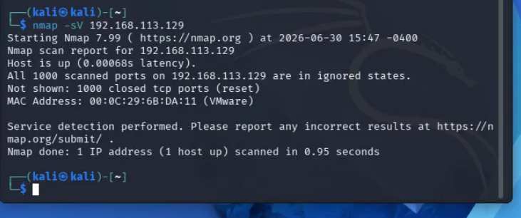
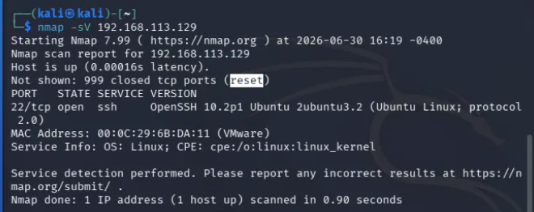
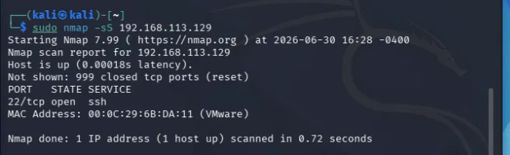
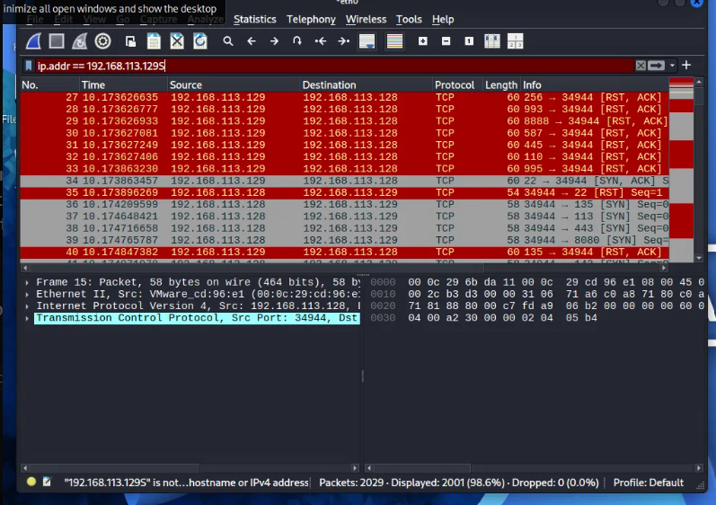
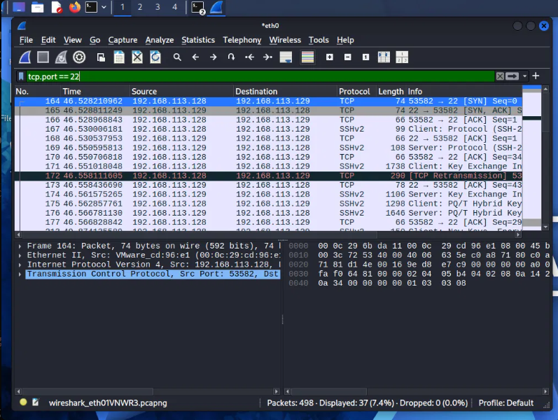
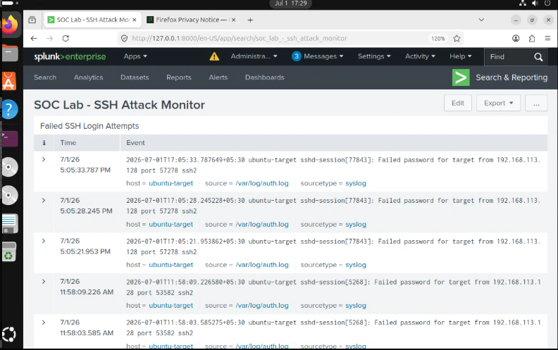
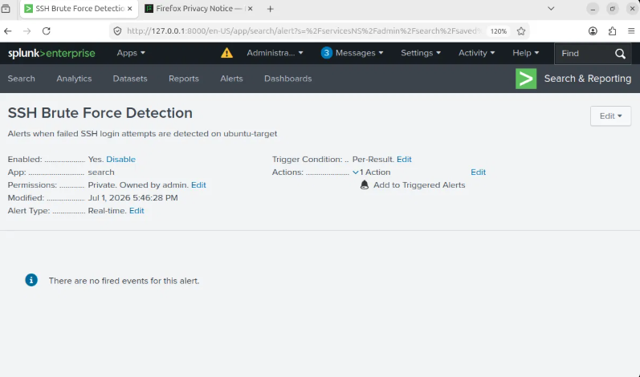
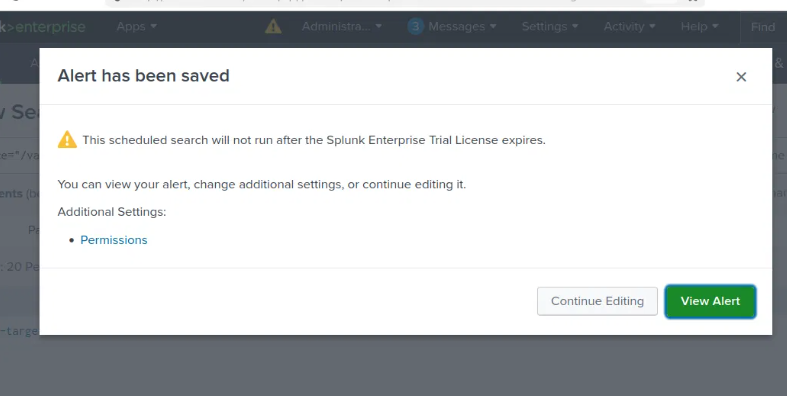

# 🛡️ Mini Security Operations Center (SOC) Lab

  

## 📌 Project Overview
A hands-on cybersecurity home lab simulating a real-world Security Operations Center (SOC) environment. This project demonstrates attack simulation, network traffic analysis, log collection, SIEM monitoring, and incident analysis using industry-standard tools.

---

## 🎯 Objectives
- Simulate cyber attacks in an isolated virtual environment
- Capture and analyze network traffic at the packet level
- Collect and forward system logs to a centralized SIEM
- Detect suspicious activity using Splunk dashboards and alerts
- Document findings in a formal SOC incident analysis report

---

## 🖥️ Lab Environment

| Component | Details |
|---|---|
| Hypervisor | VMware Workstation Pro 17.5 |
| Attacker Machine | Kali Linux 2026.2 — IP: 192.168.113.128 |
| Target Machine | Ubuntu 26.04 — IP: 192.168.113.129 |
| Network | VMware NAT (192.168.113.0/24) — Isolated |
| SIEM | Splunk Enterprise 9.4.0 |

---

## 🔧 Tools Used

| Tool | Purpose |
|---|---|
| Nmap 7.99 | Network scanning and service enumeration |
| Wireshark 4.6.6 | Packet capture and traffic analysis |
| Splunk Enterprise 9.4.0 | SIEM — log ingestion, search, dashboards, alerts |
| OpenSSH Server | Target service for attack simulation |

---

## 📋 Project Phases

### Phase 1: Virtual Environment Setup
- Deployed Kali Linux (attacker) and Ubuntu (target) VMs on VMware Workstation Pro
- Configured both VMs on VMware NAT network for isolated communication
- Verified connectivity using ping between 192.168.113.128 and 192.168.113.129

### Phase 2: Attack Simulation — Nmap Scanning
- Ran service version scan: `nmap -sV 192.168.113.129`
- Identified open port 22/tcp running OpenSSH 10.2p1
- Ran SYN stealth scan: `sudo nmap -sS 192.168.113.129`
- Confirmed port 22 open with half-open TCP connections

### Phase 3: Network Traffic Analysis — Wireshark
- Captured SYN scan traffic on eth0 interface
- Observed rapid SYN packets to multiple ports with RST/ACK responses (closed ports)
- Identified SYN/ACK response specifically for port 22 (open port)
- Captured full SSH session including TCP handshake, SSHv2 negotiation, and PQ/T Hybrid key exchange
- Confirmed SSH traffic encryption — passwords not visible in capture

### Phase 4: Log Collection and SIEM Monitoring — Splunk
- Installed Splunk Enterprise 9.4.0 on Ubuntu target machine
- Configured file monitor input on `/var/log/auth.log`
- Generated SSH brute-force attempts from Kali (6 failed login events recorded)
- Detected events using SPL query:
source="/var/log/auth.log" "Failed password" | stats count by host
- Built "SOC Lab - SSH Attack Monitor" dashboard with failed login panel and timeline chart
- Configured real-time alert "SSH Brute Force Detection" with HIGH severity

### Phase 5: Incident Analysis
- Investigated 6 failed SSH authentication events from 192.168.113.128
- Identified attacker IP, targeted username, timestamps, and attack pattern
- Documented findings in formal SOC Incident Analysis Report
- Provided mitigation recommendations including fail2ban, SSH key authentication, and firewall rules

---

## 📸 Screenshots

### Nmap — Before SSH Installation (All Ports Closed)

### Nmap — After SSH Installation (Port 22 Open)

### Nmap — SYN Stealth Scan

### Wireshark — SYN Scan Traffic

### Wireshark — SSH Brute Force Traffic

### Splunk — SOC Dashboard

### Splunk — Alert Configuration

### Splunk — Alert Saved

---

## 🔍 Key Findings

- **Attack Type:** SSH Brute Force
- **Source IP:** 192.168.113.128 (Kali Linux)
- **Target IP:** 192.168.113.129 (Ubuntu)
- **Target Port:** 22/TCP (SSH)
- **Total Failed Attempts:** 6 across 2 sessions
- **Detection Method:** Splunk real-time monitoring of /var/log/auth.log
- **Alert Severity:** HIGH

---

## 🛡️ Mitigation Recommendations

1. Disable password authentication for SSH — use key-pair only
2. Install fail2ban to auto-block IPs after repeated failures
3. Move SSH to non-standard port (not 22)
4. Restrict SSH access via UFW firewall to trusted IPs only
5. Enable Multi-Factor Authentication for SSH

---

## 📄 Incident Report
Full incident analysis report available in the `/reports` folder.

---

## 🧠 Skills Demonstrated
`Network Security` `Packet Analysis` `SIEM` `Log Analysis` `Threat Detection` `Incident Response` `Linux` `Virtualization` `SOC Operations`

---

## 👤 Author
**Atharva** | EXTC Graduate | Aspiring Cybersecurity Professional